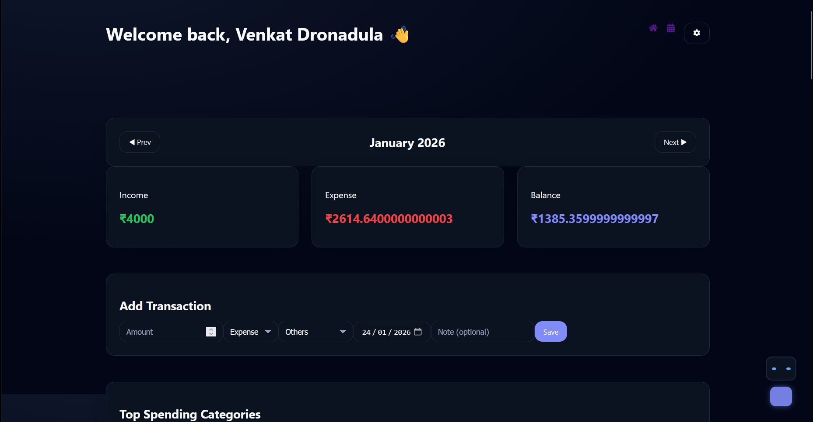
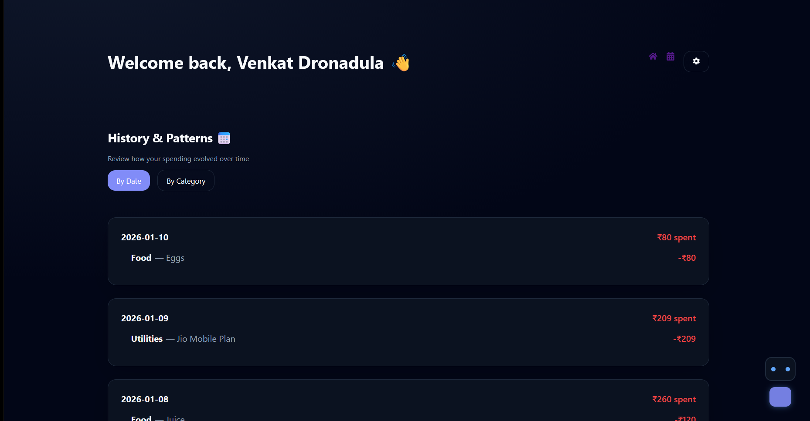
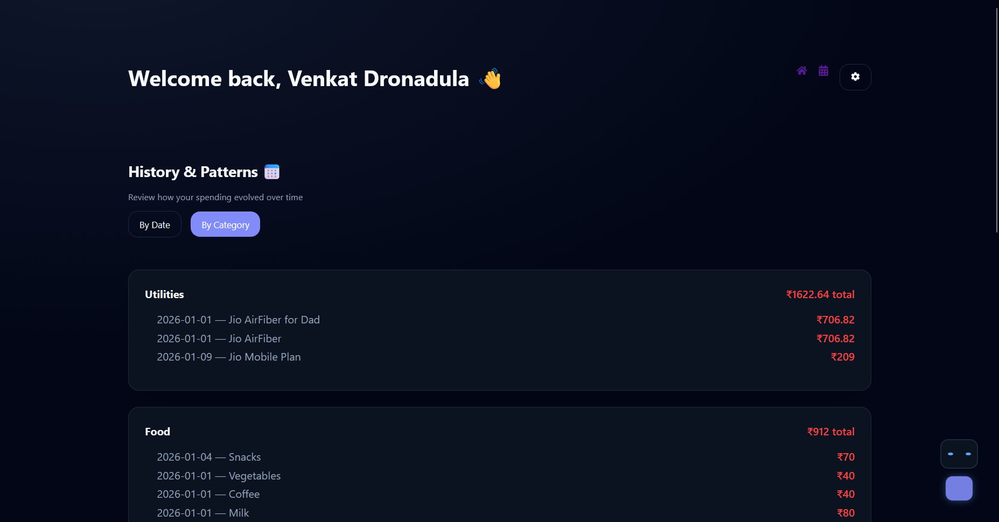
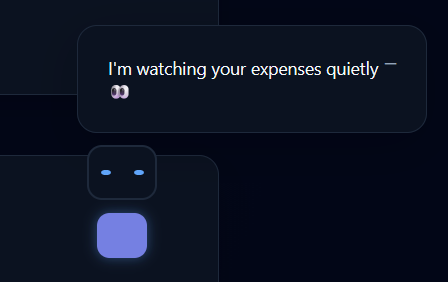
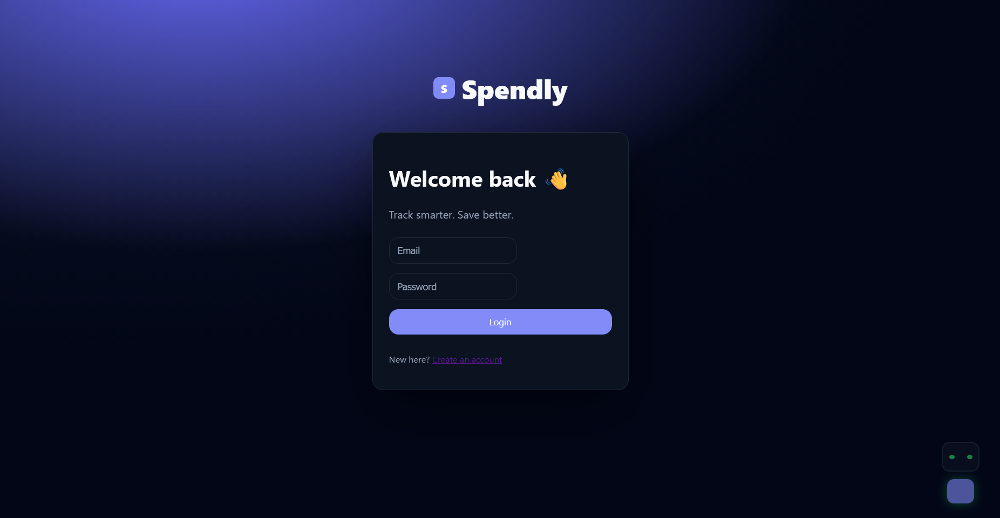

# Spendly 💸

Spendly is a modern personal finance tracker designed to help users understand and improve their spending habits through clean visuals, smart insights, and a friendly optional assistant.

The project focuses on **clarity, usability, and thoughtful UX** rather than feature overload.

---

## ✨ Features

### 📊 Dashboard
- Monthly income, expense, and balance overview
- Automatically filtered transactions by month
- Interactive charts and spending heatmap
- Top spending categories at a glance

### 🧾 Transactions
- Add, edit, and delete transactions
- Automatically sorted by date
- Category and type filtering
- Clean, readable transaction history

### 📅 History & Patterns
- View transactions grouped by **date**
- Switch to **category-wise** spending analysis
- Designed for reflection and habit awareness

### 🤖 Smart Mascot (Optional)
- Context-aware spending insights
- Auto-hide and manual minimize options
- Designed to be helpful, not distracting

### ⚙️ User Controls
- Dark / Light mode
- Reduce motion for accessibility
- Export all transactions as CSV

### 🔐 Authentication
- Secure login and registration
- Branded, polished auth experience

---

## 🛠️ Tech Stack

- **Frontend:** React + TypeScript  
- **Animations:** Framer Motion  
- **Styling:** Custom CSS (dark-mode first)  
- **State Management:** React Context API  
- **Routing:** React Router  

---

## 📸 Screenshots


### Dashboard Overview




---

### Transaction History (By Date)




---

### Transaction History (By Category)




---

### Mascot Insights




---

### Login Page




---

## 🚀 Getting Started

```bash
npm install
npm run dev
```

🎯 Design Philosophy

Minimal but expressive UI

Features that justify their presence

Clear information hierarchy

Optional guidance, never forced

🔮 Future Improvements (Optional)

Monthly budget limits

Search across transactions

Downloadable monthly reports

Cloud sync across devices

👤 Author

Venkat Dronadula
Final-year CSE (AI & ML) student
Focused on frontend engineering, UX design, and real-world projects.

📄 License

This project is for learning and portfolio purposes.
